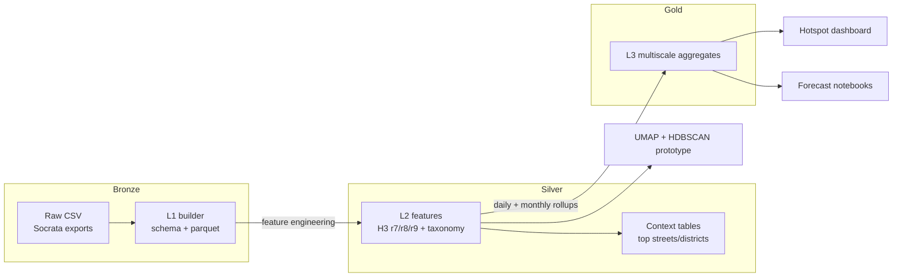

# Chicago Crimes

Operational repository for the Chicago crimes medallion pipeline.

## Latest Enhancements (September 2025)

- Crime taxonomy utility added to L2 so every record carries both `primary_type` and a grouped category for Streamlit filtering.
- Vectorised H3 assignment and aggregation keep r7/r8/r9 aligned while cutting pipeline runtimes.
- Downloader now reuses token-authenticated sessions, respects rate limits, and persists checkpoints for resumability.
- Streamlit hotspot app gained sidebar controls, multi-month selection, metric-aware colour palettes, and richer narratives.
- Updated automated tests cover the new aggregation helpers and taxonomy mapping.

## Current Processing Status (2025-09-26)

- **L1 Bronze**: Raw CSVs stored under `data/raw/`, standardized parquet partitions under `data/l1/`.
- **L2 Silver**: Feature-enriched parquet partitions with H3 identifiers (r7/r8/r9) under `data/l2/year=YYYY/month=MM/`.
- **L3 Gold**: Deterministic daily and monthly aggregates for r7/r8/r9 under `data/l3/res={res}/year=YYYY/month=MM/`.

## Runbooks

All commands assume repository root and an activated project environment.

### Rebuild L2 (L1 → L2)

```bash
python3 src/l2_features.py [start_year]
```

- Optional `start_year` (YYYY) skips older partitions. Omit to process every available year.

### Rebuild deterministic L3 aggregates

```bash
python3 src/l3_multiscale.py [year] [month]
```

- Provide year/month to scope work; omit to process all partitions.

### Run clustering prototype (UMAP + HDBSCAN)

```bash
python3 src/l3_clustering_prototype.py YEAR MONTH
```

- Requires `umap-learn` and `hdbscan` installed.

### Launch hotspot dashboard (Streamlit)

```bash
streamlit run app.py
```

- Sidebar controls: resolution (`r7/r8/r9`), year, month range, taxonomy categories, and specific crime types. Type dropdowns now show **only** the offences that belong to the categories you select.
- Hex colour defaults to incident volume; when you apply a filter it swaps to “Selected incident volume” so red/green reflects your current focus. Arrest-rate metrics invert the palette (more arrests = greener) for clarity.
- Legends and “Quick hits” narratives refresh automatically to describe the active metric and top hotspots.
- Optional checkbox reruns the clustering prototype for each selected month (results land under `data/l3/clusters/`).

### Notebook for deeper analysis

- `notebooks/01_hotspot_storytelling.ipynb` mirrors the dashboard logic with additional cells for ad-hoc exploration.

### Crime taxonomy helpers

```python
from utils import categorize_primary_type, expand_categories

categorize_primary_type('BURGLARY')  # -> 'Property'
```
- `categorize_primary_type` maps raw CPD `primary_type` strings into a curated taxonomy (Violent, Property, Narcotics, Disorder, Traffic, Unclassified).
- `expand_categories` groups any iterable of crime types for UI display—the Streamlit sidebar uses it to keep crime-type pills in sync with category choices.
- L2 materialisation writes both `primary_type` and `crime_category`, so downstream notebooks/apps can slice by either level without additional joins.

## Smoke Checks

Run this quick verification to confirm a representative L2/L3 partition:

```bash
python3 - <<'PY'
import pandas as pd
from pathlib import Path

l2_sample = Path('data/l2/year=2024/month=09/features-2024-09.parquet')
if l2_sample.exists():
    df = pd.read_parquet(l2_sample)
    print('L2 columns:', ', '.join(df.columns[:20]))
    for col in ['h3_r7', 'h3_r8', 'h3_r9']:
        print(col, 'present?', col in df.columns)
else:
    print('Missing L2 sample', l2_sample)

l3_sample = Path('data/l3/res=9/year=2024/month=09/l3-aggregates-9-2024-09.parquet')
print('L3 sample exists?', l3_sample.exists())
PY
```

## Dependencies

Key packages are pinned in `requirements.txt`. Notable extras:

- `h3` – spatial hex indexing (required for L2/L3)
- `hdbscan` – clustering backend (prototype)
- `umap-learn` – dimensionality reduction (prototype)

Install optional extras on demand, e.g. `pip install umap-learn`.

## Maintenance Notes

- L2 writes deterministic parquet schemas (no pandas `category`, timestamps normalized to `datetime64[ns]`).
- H3 assignment guards against API differences (`latlng_to_cell` vs `geo_to_h3`) and missing libraries.
- L3 aggregation tolerates alternate column names (e.g., `arrest` vs `arrest_made`) and uses vectorised math for Wilson CIs and neighbour pooling.
- Downloader reuses a token-authenticated session with retry/backoff and persists checkpoints under `data/temp/.download_checkpoint.json`.
- Streamlit maps use Plotly Mapbox; set `PLOTLY_MAPBOX_TOKEN` if you want premium tiles, or switch to `open-street-map` for offline-only demos.

### Recent Fixes

- Casted coordinates to floats to avoid `H3ResDomainError`; per-row failures now resolve to `<NA>`.
- Normalized street names even when L1 exports `block` instead of `block_address`.
- Clarified CLI: `src/l2_features.py` treats the first argument as `start_year`; it does **not** change H3 resolution.
- Added taxonomy enrichment, parent H3 derivation (r7/r8 from r9), and high-speed neighbour pooling for L3.
- Streamlit sidebar now drives crime categories/types from the taxonomy and defaults map colours to focus metrics when filters are active.

### Quick Validation Runs

- Full L2 rebuild from 2018 → 2025-08 validated `h3_r9`, cyclical encodings, street normalization, and taxonomy assignments.
- Deterministic L3 aggregates exist for r7/r8/r9 and read back without schema drift; helper scripts sanity-check daily vs. monthly totals.
- Run `pytest tests/test_pipeline.py` after pipeline changes to exercise sanitisation, taxonomy grouping, and aggregate helpers.

## Architecture Diagrams



```mermaid
sankey-beta
   source RAW L1 L2 L2 L3 L3 L3 Streamlit Streamlit Forecast
   target L1 L2 L3 Context Streamlit Forecast Clustering StreamlitUsers DataExports Stakeholders
   value 100 100 80 20 60 20 20 40 10 10
   label "Raw" "L1" "L2" "Context" "L3" "Forecast" "Clusters" "Dashboard" "Exports" "Forecast consumers"
```

## Roadmap

Future work—forecasting (ARIMA/LSTM/transformers), census enrichment, advanced clustering dashboards, and agentic exploration—is tracked in `docs/ROADMAP.md`. Those items are explicitly marked as **post-demo** so this README only reflects features that ship today.
