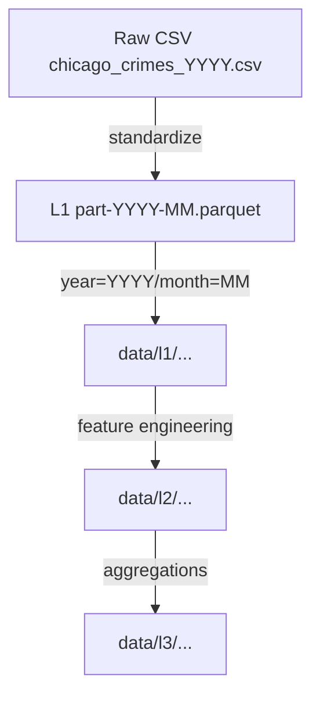

# Chicago Crimes

Operational repository for the Chicago crimes medallion pipeline.

## Current Processing Status (2025-09-26)

- **L1 Bronze**: Raw CSVs stored under `data/raw/`, standardized parquet partitions under `data/l1/`.
- **L2 Silver**: Feature-enriched parquet partitions with H3 identifiers (r7/r8/r9) under `data/l2/year=YYYY/month=MM/`.
- **L3 Gold**: Deterministic daily and monthly aggregates for r7/r8/r9 under `data/l3/res={res}/year=YYYY/month=MM/`.

## Runbooks

All commands assume repository root and an activated project environment.

### Rebuild L2 (L1 → L2)

```bash
python3 src/l2_features.py [start_year]
```

- Optional `start_year` (YYYY) skips older partitions. Omit to process every available year.

### Rebuild deterministic L3 aggregates

```bash
python3 src/l3_multiscale.py [year] [month]
```

- Provide year/month to scope work; omit to process all partitions.

### Run clustering prototype (UMAP + HDBSCAN)

```bash
python3 src/l3_clustering_prototype.py YEAR MONTH
```

- Requires `umap-learn` and `hdbscan` installed.

### Launch hotspot dashboard (Streamlit)

```bash
streamlit run app.py
```

- The dashboard uses L3 aggregates to plot daily trends, H3 hotspot maps, and highlight low-confidence cells.
- Optional checkbox reruns the clustering prototype for the selected month.

### Notebook for deeper analysis

- `notebooks/01_hotspot_storytelling.ipynb` mirrors the dashboard logic with additional cells for ad-hoc exploration.

## Smoke Checks

Run this quick verification to confirm a representative L2/L3 partition:

```bash
python3 - <<'PY'
import pandas as pd
from pathlib import Path

l2_sample = Path('data/l2/year=2024/month=09/features-2024-09.parquet')
if l2_sample.exists():
    df = pd.read_parquet(l2_sample)
    print('L2 columns:', ', '.join(df.columns[:20]))
    for col in ['h3_r7', 'h3_r8', 'h3_r9']:
        print(col, 'present?', col in df.columns)
else:
    print('Missing L2 sample', l2_sample)

l3_sample = Path('data/l3/res=9/year=2024/month=09/l3-aggregates-9-2024-09.parquet')
print('L3 sample exists?', l3_sample.exists())
PY
```

## Dependencies

Key packages are pinned in `requirements.txt`. Notable extras:

- `h3` – spatial hex indexing (required for L2/L3)
- `hdbscan` – clustering backend (prototype)
- `umap-learn` – dimensionality reduction (prototype)

Install optional extras on demand, e.g. `pip install umap-learn`.

## Maintenance Notes

- L2 writes deterministic parquet schemas (no pandas `category`, timestamps normalized to `datetime64[ns]`).
- H3 assignment guards against API differences (`latlng_to_cell` vs `geo_to_h3`) and missing libraries.
- L3 aggregation tolerates alternate column names (e.g., `arrest` vs `arrest_made`).

### Recent Fixes

- Casted coordinates to floats to avoid `H3ResDomainError`; per-row failures now resolve to `<NA>`.
- Normalized street names even when L1 exports `block` instead of `block_address`.
- Clarified CLI: `src/l2_features.py` treats the first argument as `start_year`; it does **not** change H3 resolution.

### Quick Validation Runs

- Full L2 rebuild from 2018 → 2025-08 validated `h3_r9`, cyclical encodings, and `street_norm` columns.
- Deterministic L3 aggregates exist for r7/r8/r9 and read back without schema drift.

## Architecture Diagrams

```mermaid
flowchart LR
   RAW[Raw data (CSV)] --> L1[L1 Bronze]
   L1 --> L2[L2 Silver]
   L2 --> L3[L3 Gold]
   L3 --> Analytics[Dashboards / Modeling]
```



## Roadmap

Future work—forecasting (ARIMA/LSTM/transformers), census enrichment, advanced clustering dashboards, and agentic exploration—is tracked in `docs/ROADMAP.md`. Those items are explicitly marked as **post-demo** so this README only reflects features that ship today.
