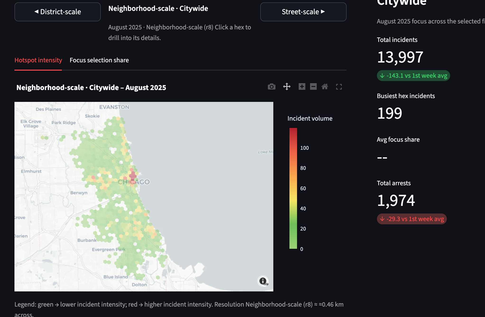
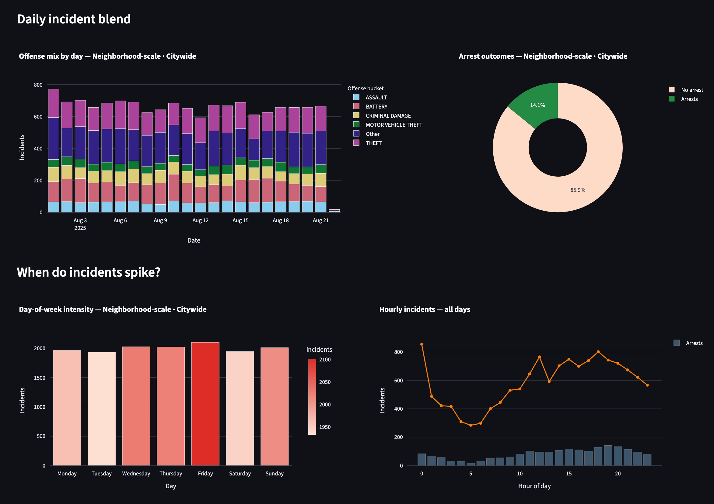
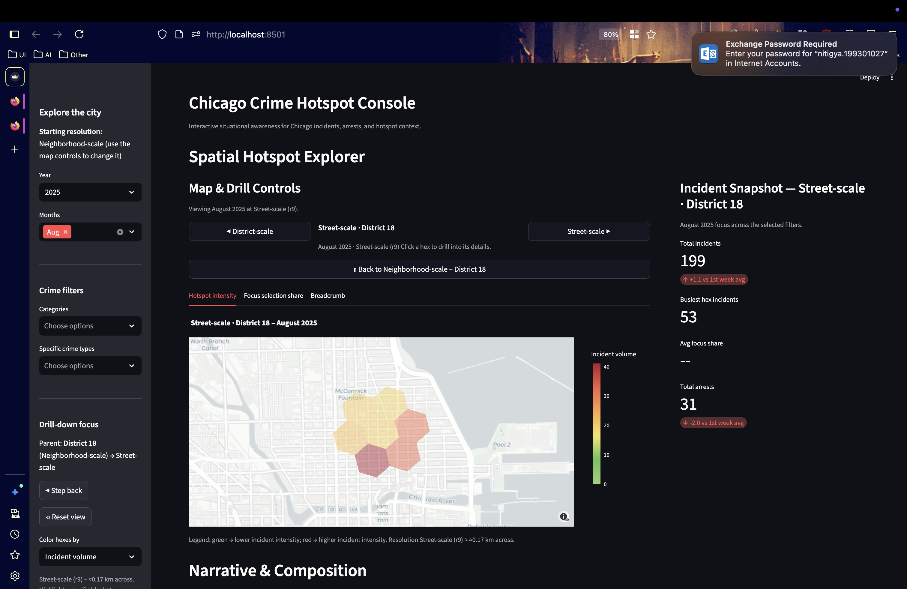

# Chicago Crime Hotspot Console

Deterministic analytics and interactive storytelling for the Chicago Police Department crime feed. This repository houses the medallion pipeline (Bronze → Silver → Gold), drill-ready H3 aggregates, and the Streamlit hotspot console that analysts use to zoom from citywide context down to micro-block detail.

[](https://chicagocrimes.streamlit.app/)

---

## Architecture at a Glance

```
Socrata API → L1 Bronze (schema+parquet) → L2 Silver (feature engineering + H3 r6–r10)
                ↓                                 ↓
         Taxonomy helpers                Context tables (streets/districts)
                ↓                                 ↓
       L3 Gold multiscale aggregates  ← Deterministic analytics scripts
                ↓                                 ↓
        Streamlit Hotspot Console  → KPI exports / Notebooks / Clustering prototypes
```

### Pipeline layers

- **L1 Bronze (`data/l1/`)** – cleans raw CSV downloads, normalises schema, persists canonical parquet partitions by `year/month`.
- **L2 Silver (`data/l2/`)** – enriches each incident with taxonomy labels, multi-resolution H3 IDs (r6–r10), arrest boolean, and street context. This layer powers most downstream features.
- **L3 Gold (`data/l3/`)** – deterministic daily + monthly aggregates for every resolution. Outputs include incident counts, arrest totals, Wilson CI arrest rates, neighbour-pooled smoothed rates, and low-confidence flags.

### Streamlit deterministic analytics stack

1. **Scope selection** – analysts pick resolution, year, and month range; taxonomy filters restrict the crime universe.
2. **Deterministic aggregation** – L3 data provides pre-computed metrics so the app never runs heavy group-bys at runtime.
3. **Spatial drill-down** – resolved by precomputed parent/child H3 maps; clicking a hex pushes a breadcrumb-driven stack (r6 → r7 → … → r10).
4. **KPI + narrative engine** – KPIs, focus-share deltas, and “Quick hits” bullet narratives are scoped to the active drill level.
5. **Temporal analytics** – stacked offense mix by day, arrest-outcome donut, interactive day-of-week selection, and hourly incident profile update in tandem.
6. **Tabular insight** – signature blocks/streets, dominant offense, and jurisdiction IDs surface for the scoped geography.

Upcoming **Statistical/ML** phases (not yet shipped) will sit beside L3: forecasting, anomaly scoring, and similarity-based clustering.

---

## Data Science Lifecycle (current release)

| Stage | What we deliver | Key techniques |
|-------|-----------------|----------------|
| **Ingest & Normalise** | Bronze parquet with stable schema | Schema inference, dtype harmonisation, timestamp conversions |
| **Feature Engineering** | Taxonomy labels, multi-resolution H3 IDs, arrest boolean | Vectorised H3 transforms, category mapping, geo fallback logic |
| **Deterministic Aggregation** | Daily/monthly tallies, smoothed arrest rates, neighbour pooling | Weighted averages, Wilson confidence intervals, multi-res lattice joins |
| **Quality Gates** | Partition-level smoke tests, coverage checks, skew warnings | Pandera checks, intensity density heuristics, missing H3 guard rails |
| **Analytic Storytelling** | Streamlit hotspot console with drill-down narratives | Plotly mapbox, KPI templating, interactive filters, stacked temporal visuals |
| **(Next) Statistical & ML** | Forecasting, clustering, anomaly detection | ARIMA/LSTM/transformers, embedding UMAP, HDBSCAN, causal uplift | 

---

## Hotspot Console – Key Capabilities

- **Multi-resolution insight** – start macroscopic (`Citywide` r6) and dive to `Street-scale` (r9) or `Micro-block` (r10) via click-to-drill.
- **Deterministic KPIs** – total incidents, busiest hex incidents, focus-share delta, arrest totals stay in sync with drill scope.
- **Focus-aware colouring** – filters flip the map palette to “Selected incident volume”; when filters are off, the palette defaults to total incidents. Arrest-rate palettes invert to highlight positive clearance.
- **Temporal analytics** – offense mix by day, arrest vs. non-arrest donut, interactive day-of-week selection that spotlights hourly patterns.
- **Contextual breadcrumbs** – each breadcrumb renders semantic labels (block, district, ward, etc.) instead of raw H3 IDs.
- **Performance tuned** – r8+ views render the top 600 cells to keep the surface responsive; deeper drills still access full detail.






---

## Getting Started

### Environment

```bash
conda env create -f environment.yml  # or pip install -r requirements.txt
conda activate chicago
```

### Refresh Silver/Gold layers

```bash
python src/l2_features.py 2020      # optional start year
python src/l3_multiscale.py 2025 08  # optional targeted rebuild
python scripts/precompute_h3_drilldown.py
```

### Launch the console

```bash
streamlit run app.py
```

- Use the sidebar to select year/month and taxonomy filters; resolution buttons on the map drive drill depth.
- Click a hex to load its children; the breadcrumb tab records drill history so you can jump back.
- KPI labels show the semantic geography (e.g., `Neighborhood-scale · District 12`).

---

## Repository Layout

```
.
├── app.py                # Streamlit console
├── data/
│   ├── raw/              # Bronze inputs (Socrata extracts)
│   ├── l1/               # Bronze parquet layers
│   ├── l2/               # Silver feature parquet
│   └── l3/               # Gold deterministic aggregates (r6–r10)
├── docs/
│   ├── assets/           # Screenshots & diagrams (add PNGs here)
│   └── ROADMAP.md        # Upcoming statistical & ML work
├── notebooks/            # Exploration notebooks (Storytelling, QA, prototyping)
├── scripts/              # Helper CLI scripts (drilldown map, diagnostics)
├── src/                  # Pipeline entry points and shared utilities
└── tests/                # pytest-based regression checks
```

---

## Maintenance & QA

- `pytest tests/test_pipeline.py` after pipeline changes.
- `python scripts/precompute_h3_drilldown.py` whenever H3 coverage changes.
- Monitor warnings surfaced by the dashboard (`r10` sparsity density prompts, missing partitions, etc.).

---

## Roadmap (Deterministic → Statistical/ML)

- ✅ Deterministic L1–L3 pipeline, taxonomy-aware H3 features, drill-down maps.
- 🔄 Enrich with census & beat-level context for narrative cards.
- 🔜 Statistical forecasts (ARIMA/Prophet) and causal uplift experiments.
- 🔜 ML clustering + embeddings for automated hotspot segmentation.
- 🔜 Alerting/notification layer (Slack/Teams) powered by deterministic anomaly detection.

For detailed milestones, see `docs/ROADMAP.md`.

---

## License

Internal analytics project – see `LICENSE` (or company policy) for usage restrictions.
